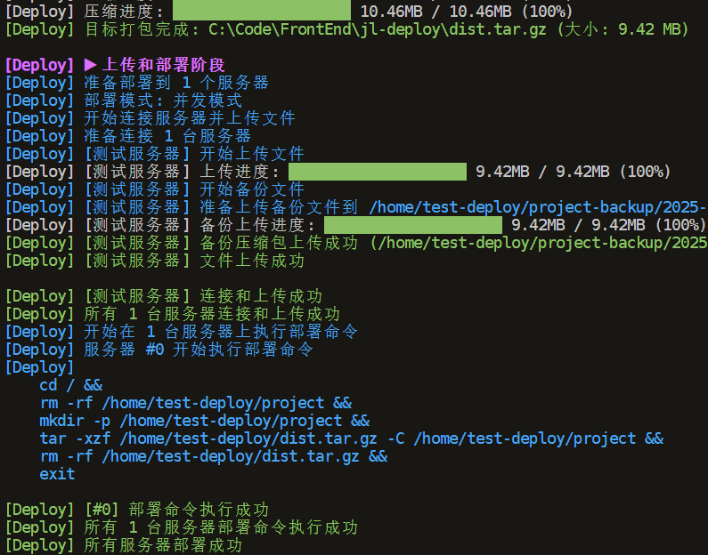

# Deploy

一个基于 SSH 的自动化部署工具，支持多服务器部署、文件备份、交互式部署和自定义部署流程

<p align="center">
  
  
  
  
  
</p>

## 特性

- 自动构建、压缩、上传和部署
- 支持多服务器并行部署
- **🤝 交互式部署模式**：在每个阶段询问用户确认，提供精细控制
- 支持远程文件备份和清理
- 友好的彩色日志输出
- 自定义上传和部署行为
- 可跳过构建步骤，提高部署效率
- **🎣 丰富的生命周期 Hooks**：在每个部署阶段前后执行自定义逻辑
- **⚠️ 结构化错误处理**：统一的错误码和错误类型，便于 CI/CD 集成



## 安装

```bash
npm install jl-deploy
# 或
yarn add jl-deploy
# 或
pnpm add jl-deploy
```


## 基本用法

`scripts/deploy.cjs`
```js
// @ts-check
const { deploy } = require('@jl-org/deploy')
const { resolve } = require('node:path')
const { homedir } = require('node:os')
const { readFileSync } = require('node:fs')

deploy({
  // ======================
  // * SSH 连接信息
  // ======================
  connectInfos: [
    {
      name: 'server-1', // 服务器名称（可选，用于日志显示）
      host: '192.168.1.100',
      port: 22,
      username: 'root',
      password: 'password',
      // 如果使用私钥登录，不使用密码登录的话
      // privateKey: readFileSync(resolve(homedir(), '.ssh/id_rsa'), 'utf-8'),
    }
  ],
  
  // ======================
  // * 本地构建配置
  // ======================
  buildCmd: 'npm run build', // 构建命令
  distDir: resolve(__dirname, '../dist'), // 构建产物目录
  skipBuild: false, // 是否跳过构建步骤
  
  // 压缩文件配置
  zipPath: resolve(__dirname, '../dist.tar.gz'), // 本地压缩文件路径
  
  // ======================
  // * 远程服务器配置
  // ======================
  remoteZipPath: '/home/dist.tar.gz', // 远程压缩文件路径
  remoteUnzipDir: '/home/test-project', // 远程解压目录
  remoteCwd: '/', // 远程命令执行路径
  deployCmd: '', // 远程服务器部署命令，和 customDeploy 回调冲突
  
  // ======================
  // * 备份配置（可选）
  // ======================
  remoteBackupDir: '/home/test-project-backup', // 远程备份目录
  maxBackupCount: 5, // 保留最近的备份数量
  
  // ======================
  // * 其他选项
  // ======================
  needRemoveZip: true, // 是否需要删除本地压缩文件
  uploadRetryCount: 3, // 上传失败重试次数
  interactive: false, // 禁用交互模式（默认）
  concurrent: true // 并发部署（默认）
})
```

启用交互模式后，系统将在每个阶段前询问：
- 🔨 **构建阶段**：是否执行构建命令
- 📦 **压缩阶段**：是否压缩构建产物
- 🚀 **上传和部署阶段**：是否上传并部署到服务器
- 🧹 **清理阶段**：是否清理本地临时文件

---

## 高级用法

### 自定义上传行为

```js
deploy({
  // ...基本配置
  
  // 自定义上传行为
  customUpload: async (createServer) => {
    const server = createServer()
    // 自定义连接和上传逻辑
    return [server]
  }
})
```

### 自定义部署行为

```js
deploy({
  // ...基本配置
  
  // 自定义部署行为
  customDeploy: async (servers, connectInfos) => {
    // 自定义解压和部署逻辑
    for (const server of servers) {
      // 执行自定义部署命令
    }
  }
})
```

### 服务器就绪回调

```js
deploy({
  // ...基本配置
  
  // 服务器连接成功回调
  onServerReady: async (server, connectInfo) => {
    // 服务器连接成功后，部署前的自定义操作
  }
})
```

### 生命周期 Hooks

```js
deploy({
  // ...基本配置
  
  // 构建阶段 hooks
  onBeforeBuild: async (context) => {
    console.log('准备开始构建...', context.buildCmd)
  },
  onAfterBuild: async (context) => {
    console.log('构建完成！')
  },
  
  // 压缩阶段 hooks
  onBeforeCompress: async (context) => {
    console.log('开始压缩文件...', context.distDir)
  },
  onAfterCompress: async (context) => {
    console.log('压缩完成！', context.zipPath)
  },
  
  // 连接阶段 hooks
  onBeforeConnect: async (context) => {
    console.log('准备连接服务器...', context.connectInfos.length)
  },
  onAfterConnect: async (context) => {
    console.log('服务器连接成功！')
  },
  
  // 上传阶段 hooks（每个服务器单独触发）
  onBeforeUpload: async (context) => {
    console.log('开始上传到:', context.connectInfo.host)
  },
  onAfterUpload: async (context) => {
    console.log('上传成功:', context.connectInfo.host)
  },
  
  // 部署阶段 hooks
  onBeforeDeploy: async (context) => {
    console.log('开始部署...', context.sshClients.length)
  },
  onAfterDeploy: async (context) => {
    console.log('部署完成！')
  },
  
  // 清理阶段 hooks
  onBeforeCleanup: async (context) => {
    console.log('准备清理临时文件...', context.zipPath)
  },
  onAfterCleanup: async (context) => {
    console.log('清理完成！')
  },
  
  // 全局错误处理 hook
  onError: async (context) => {
    console.error('部署出错:', context.error.code, context.error.message)
    
    // 发送错误通知，记录日志等
    await sendErrorNotification(context.error)
    
    // 返回 true 表示错误已处理，继续执行；返回 false 或不返回表示重新抛出错误
    return false
  }
})
```

### 错误处理

该工具提供了结构化的错误处理，便于 CI/CD 集成：

```js
import { deploy, DeployError, DeployErrorCode } from 'jl-deploy'

try {
  await deploy({
    // 配置...
  })
} catch (error) {
  if (error instanceof DeployError) {
    console.error('部署错误码:', error.code)
    console.error('错误消息:', error.message)
    console.error('服务器:', error.serverName)
    console.error('详细信息:', error.details)
    
    // 根据错误码执行不同的处理逻辑
    switch (error.code) {
      case DeployErrorCode.BUILD_COMMAND_FAILED:
        // 构建失败处理
        break
      case DeployErrorCode.CONNECT_SSH_FAILED:
        // SSH 连接失败处理
        break
      case DeployErrorCode.UPLOAD_FILE_FAILED:
        // 文件上传失败处理
        break
      // ...
    }
  }
}
```

## 配置选项

| 选项 | 类型 | 默认值 | 描述 |
| --- | --- | --- | --- |
| `connectInfos` | `ConnectInfo[]` | - | **必填**，SSH 连接信息数组 |
| `buildCmd` | `string` | `'npm run build'` | 构建命令 |
| `skipBuild` | `boolean` | `false` | 是否跳过构建步骤 |
| `interactive` | `boolean` | `false` | 是否启用交互式部署模式 |
| `concurrent` | `boolean` | `true` | 是否并发部署到多个服务器 |
| `deployCmd` | `string` | *见下方* | 远程服务器部署命令 |
| `distDir` | `string` | - | **必填**，构建产物目录路径 |
| `zipPath` | `string` | - | **必填**，压缩文件路径 |
| `remoteZipPath` | `string` | - | **必填**，远程压缩文件路径 |
| `remoteUnzipDir` | `string` | - | **必填**，远程解压目录路径 |
| `remoteBackupDir` | `string` | - | 远程备份目录路径 |
| `maxBackupCount` | `number` | `5` | 最大备份数量 |
| `remoteCwd` | `string` | `'/'` | 远程命令执行路径 |
| `needRemoveZip` | `boolean` | `true` | 是否删除本地压缩文件 |
| `uploadRetryCount` | `number` | `3` | 上传失败重试次数 |
| `onServerReady` | `function` | - | 服务器准备完毕回调 |
| `customUpload` | `function` | - | 自定义上传行为 |
| `customDeploy` | `function` | - | 自定义部署行为 |

### 生命周期 Hooks

| Hook | 类型 | 描述 |
| --- | --- | --- |
| `onBeforeBuild` | `function` | 构建阶段开始前的回调 |
| `onAfterBuild` | `function` | 构建阶段完成后的回调 |
| `onBeforeCompress` | `function` | 压缩阶段开始前的回调 |
| `onAfterCompress` | `function` | 压缩阶段完成后的回调 |
| `onBeforeConnect` | `function` | 连接阶段开始前的回调 |
| `onAfterConnect` | `function` | 连接阶段完成后的回调 |
| `onBeforeUpload` | `function` | 上传阶段开始前的回调（每个服务器单独触发） |
| `onAfterUpload` | `function` | 上传阶段完成后的回调（每个服务器单独触发） |
| `onBeforeDeploy` | `function` | 部署阶段开始前的回调 |
| `onAfterDeploy` | `function` | 部署阶段完成后的回调 |
| `onBeforeCleanup` | `function` | 清理阶段开始前的回调 |
| `onAfterCleanup` | `function` | 清理阶段完成后的回调 |
| `onError` | `function` | 全局错误处理回调 |

**默认部署命令:**

```bash
cd ${remoteCwd} &&
rm -rf ${remoteUnzipDir} &&
mkdir -p ${remoteUnzipDir} &&
tar -xzf ${remoteZipPath} -C ${remoteUnzipDir} &&
rm -rf ${remoteZipPath} &&
exit
```

## 错误码

常见的错误码包括：

- `CONFIG_VALIDATION_FAILED` - 配置验证失败
- `BUILD_COMMAND_FAILED` - 构建命令执行失败
- `COMPRESS_SOURCE_NOT_FOUND` - 压缩源目录不存在
- `CONNECT_SSH_FAILED` - SSH 连接失败
- `UPLOAD_FILE_FAILED` - 文件上传失败
- `DEPLOY_COMMAND_FAILED` - 部署命令执行失败
- `USER_CANCELLED` - 用户取消操作

更多错误码请参考 [DeployErrorCode](src/types/error.ts) 枚举

## 注意事项

1. `remoteUnzipDir` 不应与 `remoteZipPath` 的目录相同，因为部署过程中会先删除 `remoteUnzipDir` 目录
2. 使用自定义 `deployCmd` 时，命令末尾必须有换行符
3. `skipBuild` 为 true 时，会检查构建产物目录是否存在，不存在则报错
4. 在 CI/CD 环境中，使用 `interactive: false` 以避免阻塞
5. 使用 hooks 可以在部署流程的各个阶段执行自定义逻辑，便于集成监控、通知等功能
6. 错误处理提供了结构化的错误信息，便于 CI/CD 系统根据错误码执行不同的处理策略
